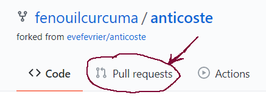
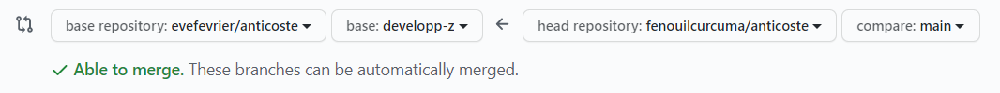

# Contribuer

## Branches
Nom | Rôle 
--- | ---
Main | Pour déploiement
developp-a  | Développement groupe 1
developp-b | Développement groupe 2

## Débuter le travail
(1) Fourcher le répertoire https://github.com/evefevrier/anticoste.git  
(2) Cloner la fourche https://github.com/*UTILISATEUR*/anticoste.git  
(3) Créer les fichiers personnels selon nomenclature et procédure  


## Définir les serveurs distants
Vérifier d'abord le serveur distant enregistré lors du clonage
``` 
git remote -v 
```
Devrait retourner:
``` 
origin  https://github.com/*UTILISATEUR*/anticoste.git (fetch)
origin  https://github.com/*UTILISATEUR*/anticoste.git (push)
``` 
Ajouter comme 2ème serveur distant le répertoire initial
``` 
git remote add upstream https://github.com/evefevrier/anticoste.git
``` 
À présent
``` 
git remote -v 
```
Devrait retourner:
``` 
origin  https://github.com/*UTILISATEUR*/anticoste.git (fetch)
origin  https://github.com/*UTILISATEUR*/anticoste.git (push)
upstream  https://github.com/evefevrier/anticoste.git (fetch)
upstream  https://github.com/evefevrier/anticoste.git (push)
``` 

## Routine de travail
(0) Commencer la séance de travail en récupérant (pull) le travail des coéquipier.e.s.  
pour le groupe 1:
``` 
git pull upstream developp-a
``` 
pour le groupe 2:
``` 
git pull upstream developp-b
```
(1) Sauvegarder localement avec les commandes
``` 
git status  
git add .  
git status  
git commit -m "message"  
```
(2) Pousser sur le Github personnel les modifications
``` 
git push origin main
```


## Faire un Pull Request 
1.	Accomplir d'abord la __routine de travail__ en vérifiant bien les réponses du terminal pour vous assurer que chaque commande est exécutée.  
2.	Dans l'interface de Github, dans le répertoire personnel du projet, cliquer le bouton *Pull Requests*.
3.	Cliquer le bouton *New Pull Request*  
        
4.	Choisir base : evefevrier/anticoste : __developp-a__ ou __developp-b__     
      *Selon votre groupe! Groupe 1: developp-a et groupe 2: developp-b*  
      Choisir head : UTILISATEUR/anticoste compare: main  
        
5.	Cliquer le bouton *Create Pull Request*
6.	Donner un titre à votre *Pull Request*, puis,  
      cliquer le bouton *Confirm Pull Request*.


## Bogues et améliorations suggérés
Utiliser le [journal](http://github.com/evefevrier/anticoste/issues) du projet!

:rocket: :metal: :octocat: :+1: :sparkles:


 